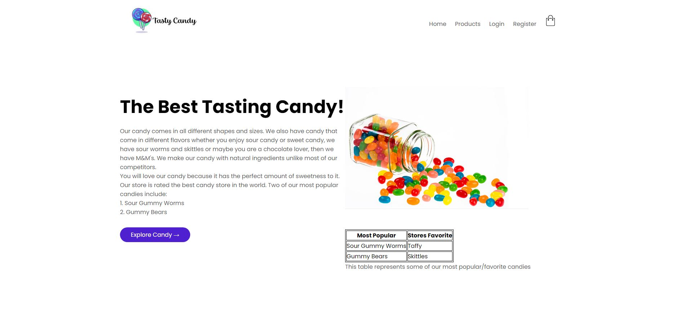
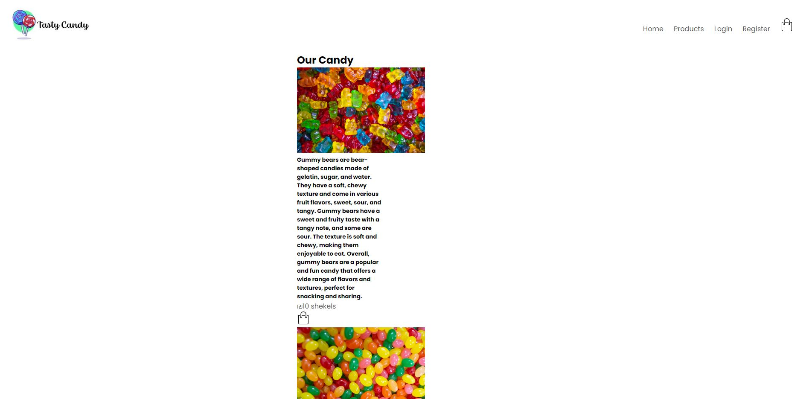
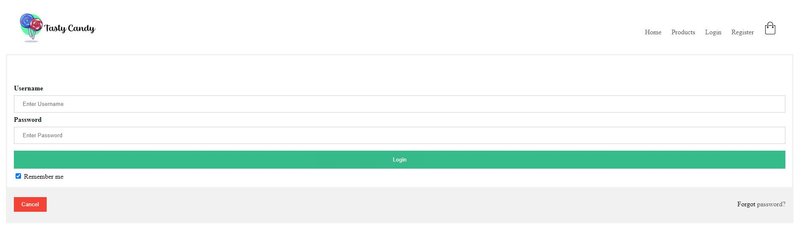
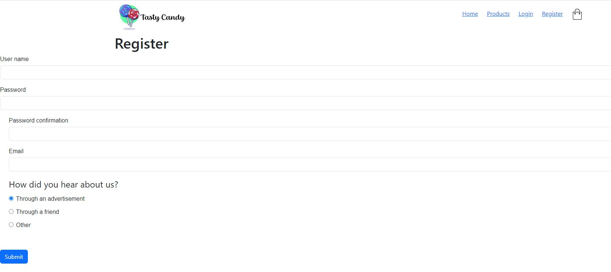
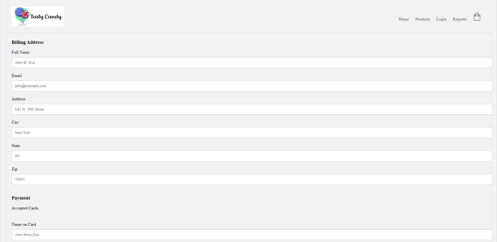

Capstone-Tasty Candy

  My ecommerce website is titled: Tasty Candy
  My websites home page contains a header, two paragraphs, a list of our two most popular candies, a picture, a table, and an "Explore Candy" button that brings you to the products page when clicked on. The products home page consists of a title, 6 bootstrap cards with images, paragraphs, the price of the item and an add to bag icon. The login page consists of a Username, Password, login button, remember me check box, forgot password, and a cancel button. There is proper form validation for the login page. The register page contains a username,password, password confirmation, email, a "how did you hear about us?" with radio buttons and options, with a submit button at the bottom. The checkout page includes a checkout form and a cart with three items in there.

  Preview:
  
  
  
  
  

